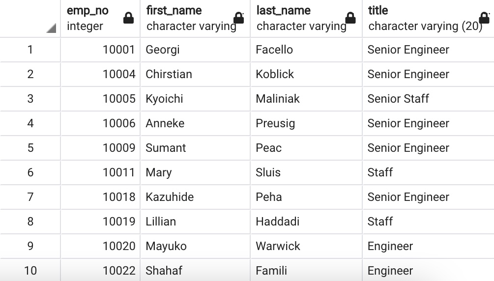
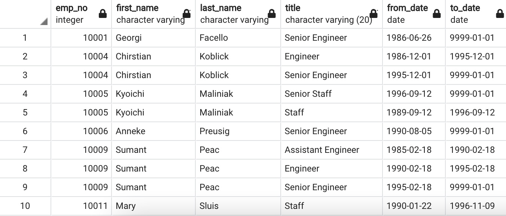
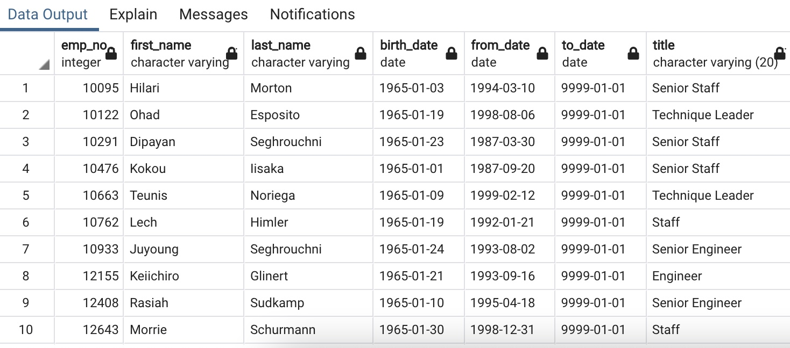

# Pewlett Hackard Analysis

## Overview of Analysis
Using our SQL skills, determine the number of retiring employees per title and identify tthe employees who are eligiblee to participate in a mentorship program to help Bobby's manager prepare for the "silver tsunami."

## Results
1. The Unique Titles Table in Deliverable 1 (partially illustrated below) shows:
    - A total of 90,398 employees will be retiring.

2. The Retiring Titles Table in Deliverable 1 (partially illustrated below) shows: 
    - 29,414 employees retiring are Senior Engineers.
    - 28,254 employees retiring are Senior Staff.
    - 14,222 employees retiring are Engineers.
    - 12,243 employees retiring are Staff.
    - 4502 employees retiring are Technique Leaders.
    - 1761 employees retiring are Assistant Engineers.
    - 2 employees retiring are Managers.

3. The Mentorship Eligibilty Table in Deliverable 2 (partially illustrated below) shows:
    - A total of 1,549 employees are eligible for the a mentorship program.

4. Looking at both Deliverable 1 and 2, we can see:
    - Only 1,549 out of 90,398 retiring employees are eligible for a mentorship program (1.71%)

## Summary
1. How many roles will need to be filled as the "silver tsunami" begins to make an impact?
    - There are 90,398 roles that will need to be filled as soon as the "silver tsunami" begings to make an impact. 

2. Are there enough qualified, retirement-ready employees in the department to mentor the next generation of Pewlett Hackard employees?
    - Not at all. As the "silver tsunami" begins to role out and assuming all eligible mentors agree to mentor, there will only be 1,549 mentors for the 90,398 vacant roles. This creates a 1-to-58 mentor to employees ratio which is not very realistic. Pewleett Hackard will be in need of a lot more mentors. 

3. Two additional queries or tables that may provide more insight into the upcoming "silver tsunami" is a quarie/table that gives us the total number of retirement-ready employees per department and then another quarie/table that gives us the number of mentorship program eligible employees per department to see which departments need the most mentors. Due to the small precentage of eligible employees I would predict most departments would need a lot of mentors and would therefore, reecommend that Pewlett Hackard review the criteria to qualify for the mentorship program in order to better prepare for the "silver tsunami" impact. 

### Unique Titles Table

### Retiriing Titles Table

### Mentorship Eligibility Table
